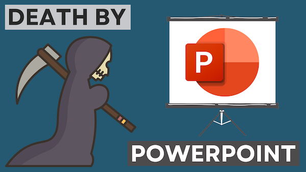

# Death by PowerPoint -or- Pursuasive Presentations

- Pre-workshop activities: 30 min 
- Introductory presentation: 10 min
- Hands-on activities: 50 min

## Creating Pursuasive & Engaging Presentations 

We have all been there before… In a class or a meeting, the presenter is reading text off of densely packed PowerPoint slide after slide. If it isn’t death by PowerPoint, reading text off [poorly constructed slides](https://www.pcworld.idg.com.au/slideshow/366369/world-worst-powerpoint-presentations/){:target="_blank"} to an audience is a very ineffective way to teach or convey information in a business setting. 

In this workshop we’re going to focus on learning and usings tips and tricks so your presentations engage and persuade, and not bore your audience to death by PowerPoint.

## Learning objectives

At the end of this workshop, you will be able to:

1. Create a short instructional multimedia presentation that follows 9 presentation best practices and techniques
2. List 7 storytelling techniques that can help make PowerPoint presentations more engaging
5. Import 4 or more photos and/or graphics into your PowerPoint or Google presentation, including at least one Creative Commons licensed image from one of the websites highlighted in the workshop
 
[NEXT STEP: Pre-Workshop Activities](pre-workshop.html){: .btn .btn-blue }
