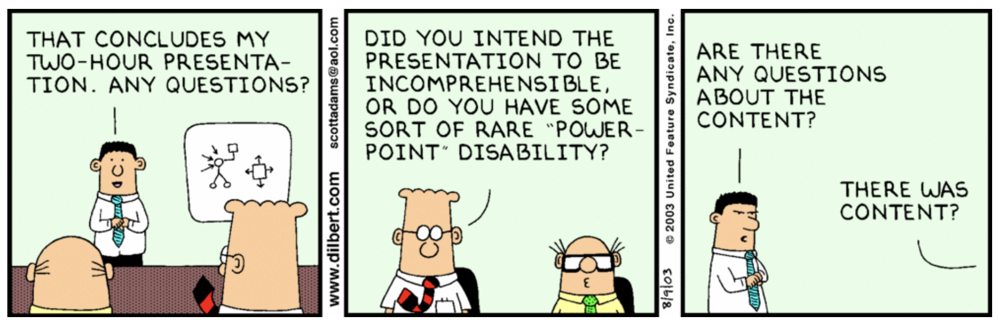

# Death by PowerPoint -or- Persuasive Presentations?

- Pre-workshop activities: 30 min 
- Introductory presentation: 10 min
- Hands-on activities: 90 min

## Creating Pursuasive & Engaging Presentations 

We have all been there before… In a class or a meeting, the presenter reads text off of densely packed PowerPoint slide after slide. If it isn’t death by PowerPoint, reading text off [poorly constructed slides](https://www.pcworld.idg.com.au/slideshow/366369/world-worst-powerpoint-presentations/){:target="_blank"} to an audience is a very ineffective way to teach or convey information in a business setting. 

In this workshop, we’re going to focus on learning and using tips and tricks so your presentations engage and persuade, and not bore your audience to death by PowerPoint.

## Learning objectives

At the end of this workshop, you will be able to:

1. Create a 1-2 minute (or more) narrated multimedia presentation on a topic you're interested in
2. Follow the 9 presentation best practices and techniques outlined in this workshop
3. Include a story in your presentation that takes advantage of 5 or more of the 7 storytelling techniques outlined in this workshop
4. Import 4 or more photos and/or graphics into your PowerPoint or Google presentation including at least one Creative Commons licensed image
5. Record your presentation using a screen capture tool
 
[NEXT STEP: Pre-Workshop Activities](pre-workshop.html){: .btn .btn-blue }
