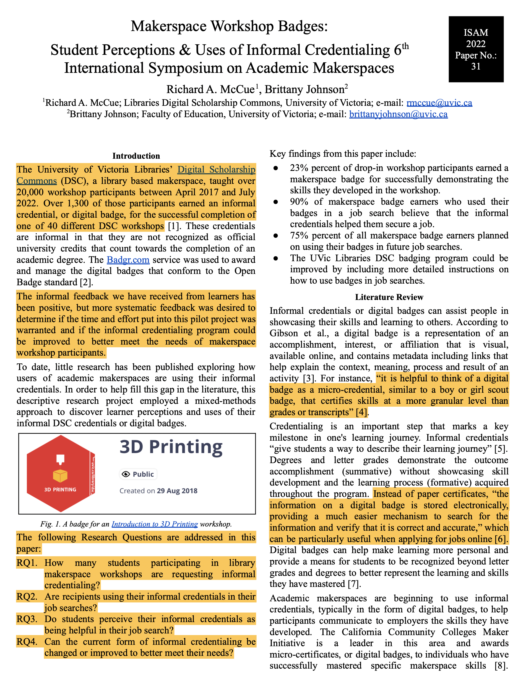

# Choosing a Topic & Identifying Key Points
## The Presentation Topic

For this workshop, we will provide you with a research paper to use as the base for you to create a persuasive and engaging presentation. If you'd like to use your own topic or paper for the presentation, please go ahead and follow along with the provided research paper instructions to make your own presentation. That said, it will take you longer to create your own presentation during the workshop as you will be provided with processed information for the provided paper that you will have to generate on your own for your own topic (like the most interesting facts or information to communicate for example).

> The article we'll create a presentation for is called, [**Makerspace Workshop Badges: Student Perceptions & Uses of Informal Credentialing**](images/makerspace-badge-paper.pdf){:target="_blank"}. Please go ahead and skim through the _Introduction_ and _Discussion_ sections of the paper to get an idea of what it is about and help us identify the key points to communicate.

## Know Your Audience

It's so important to know who your audience is! Is your audience your professor and classmates for a class presentation? Is your audience a group of your peers at an academic conference? Is your audience a community group of retired folk, or an elementary school class? 

In each case, the key points you discuss, and the language you use should be somewhat different. For example, the language and cultural reference you use for a group of university students will be quite different than the simple language, and "Paw Patrol" reference you might use for a group of elementary students. Different audiences mean different cultural references and different stories that will resonate with each group.

> The audience for the Makerspace Workshop Badge presentation will be a group of peers consisting of:
> - **University makerspace staff**
> - **Engineering professors**
> - **Librarians who work in university library makerspaces**

## Time Constraints
We often have, or are given, a maximum time for our presentations, whether the time limit is given to us by conference organizers, or because we have a specific amount of time to lecture during a class. 
> In the case of the provided Makerspace Workshop Badge paper, the conference where it was presented had a hard time limit of 10 minutes for all presentations. Today we'll set the **presentation time limit at 5-minutes** to make it easier to complete the presentation by the end of the workshop
> - **How many sides for a 5-minute presentation?** If you follow the guidelines in this workshop, you should allow for approximately **30 seconds per slide**. That would mean in the case of the provided research paper, **limiting the number of slides to 10**. 
- Once you've completed a first draft of the presentation you can time yourself doing a practice presentation and see if it takes more or less than 10 minutes to present the slides and adjust accordingly.

## Identifying Key Points for Your Presentation
To identify the key points of the article or paper you will base your presentation on you may find it helpful to keep these two points in mind as you read through the document, and then highlight the passages that meet the criteria:
- **What are the most interesting facts or pieces of information in the document or topic?** For example in the Makerspace Badging article, the methods section of the article really isn't that interesting to a general audience, but the _Results_ and _Discuission_ sections (and to a lesser extent the _Literature Review_) have interesting facts and take-a-ways.
- **What do you want someone who has finished reading the document to know?** Again, it's important to keep in mind who your audience is at this point because what is important to your professor, will probably be noticeably different than a presentation on the same topic to a group of elementary students.

>Key Points and interesting facts from the [Makerspace Workshop Badges: Student Perceptions & Uses of Informal Credentialing](images/makerspace-badge-paper.pdf){:target="_blank"} paper
> - Informal feedback from learners on the UVic Libraries makerspace badging project has been positive.
> - The University of Victoria Libraries’ Digital Scholarship Commons (DSC) taught over 20,000 workshop participants and over 1,300 of those participants earned a digital badge.
> - To date, little research has been published exploring how users of academic makerspaces are using their informal credentials.
> - A mixed-methods approach to this research topic was taken, with an exploratory survey sent to all DSC workshop badge recipients. Follow-up semi-structured qualitative interviews were conducted with a subset of survey participants to explore topics in greater depth.
> - 23% percent of drop-in workshop participants earned a makerspace badge for successfully demonstrating the skills they developed in the workshop.
> - 90% of makerspace badge earners who used their badges in a job search believe that the informal credentials helped them secure a job.
> - 75% percent of all makerspace badge earners planned on using their badges in future job searches.
> - The UVic Libraries DSC badging program could be improved by including more detailed instructions on how to use badges in job searches.

Please do not hesitate to ask the instructor leading the workshop if you have any questions, or would like feedback on your choice of topic.

[NEXT STEP: Select a Story to Engage](story.html){: .btn .btn-blue }

PAW Patrol. (2024). Wikipedia, the free encyclopedia. [https://simple.wikipedia.org/w/index.php?title=PAW_Patrol&oldid=9383206](https://simple.wikipedia.org/w/index.php?title=PAW_Patrol&oldid=9383206){:target="_blank"}

